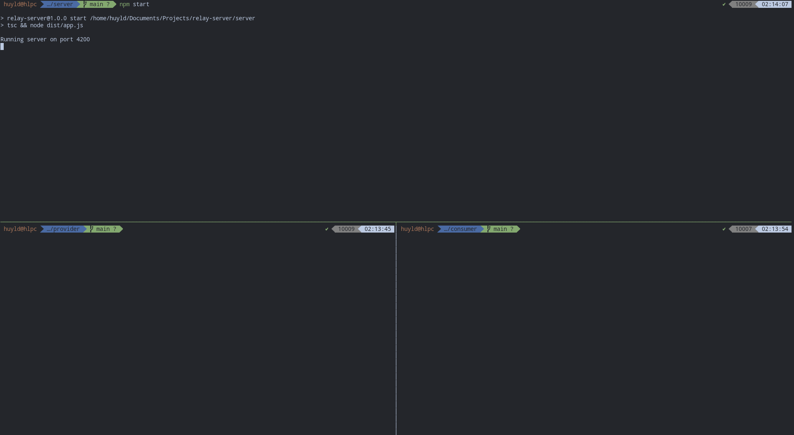
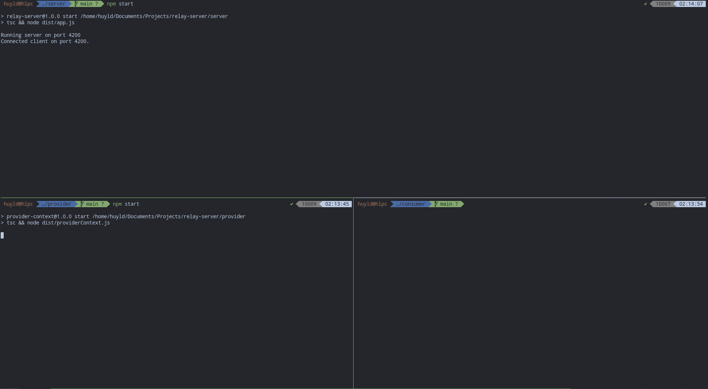
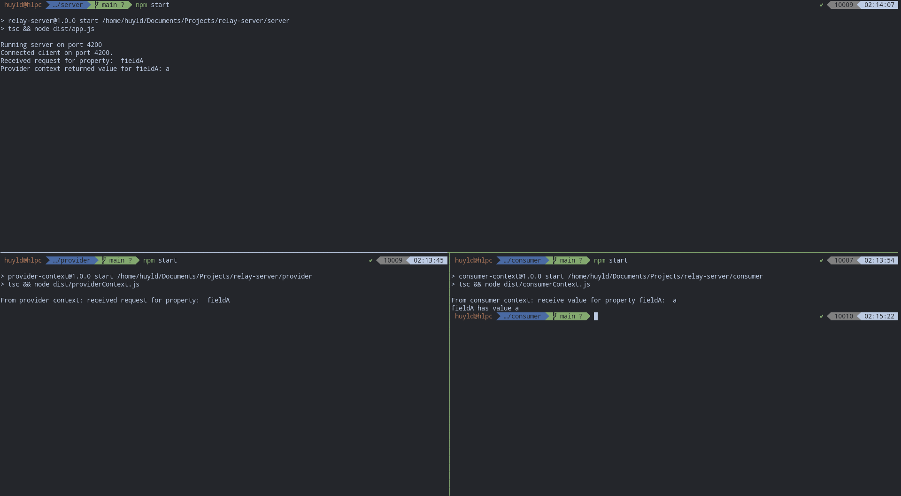

# Relay Server
A server that helps consumer context access properties of shared object from another context.

## Parties
### Relay server
- Maintain a web socket with the provider context.
- Listen to requests from the consumer context. Then emits event to the provider context to get the value of shared object's property. After that the server returns the received value to consumer context.

### Provider context
- Open a web socket to the relay server.
- Whenever the relay server emits an event via said socket, it provides the requested value.

### Consumer context
- Send HTTP requests to the relay server for values of shared object's properties.

## How to run
Install packages in all directories: `server`, `provider` and `consumer`.
```bash
npm install
```

Then run `npm start` in each directory in order:
1. server
2. provider
3. consumer

To test different property, modify `PROPERTY_NAME` in `consumer/src/consumerContext.ts` file.

## Example
1. 
2. 
3. 
